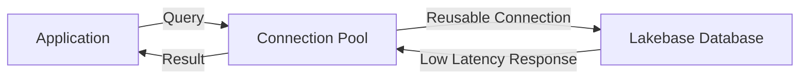

# Images and Supporting Materials

This directory contains images and supporting materials for the Lakebase Core Concepts workshop.

## Contents

This folder is intended for:

- Architecture diagrams
- Workflow illustrations
- Screenshot examples
- Reference materials

## Usage

Images should be referenced in the workshop notebooks using relative paths:

```markdown

```

## Image Guidelines

When adding images to this directory:

1. **Naming Convention**: Use descriptive, lowercase names with hyphens
   - Good: `lakebase-connection-pool.png`
   - Bad: `Image1.png`

2. **File Formats**:
   - PNG for screenshots and diagrams
   - SVG for vector graphics (preferred for architecture diagrams)
   - JPG for photos

3. **File Size**: Keep images optimized
   - Compress large images before adding
   - Recommended max size: 500KB per image

4. **Organization**: Group related images with prefixes
   - `01-architecture-*.png`
   - `02-database-*.png`
   - `03-connection-*.png`

## Suggested Images to Add

The following images would enhance the workshop:

### Lecture 1: Core Concepts
- `01-lakebase-architecture.png` - Overall architecture diagram
- `01-separated-compute-storage.png` - Compute/storage separation illustration
- `01-oltp-vs-olap-comparison.png` - Comparison diagram

### Lab 2: Creating Database
- `02-create-database-ui.png` - UI screenshot for database creation
- `02-database-configuration.png` - Configuration options
- `02-database-monitoring.png` - Monitoring dashboard

### Lecture 3: Access Methods
- `03-connection-methods.png` - Different connection methods
- `03-connection-pool-diagram.png` - Connection pool architecture
- `03-security-best-practices.png` - Security configuration

### Lab 4 & 5: Python Access
- `04-single-connection-pattern.png` - Single connection flow
- `05-connection-pool-pattern.png` - Connection pool flow
- `05-pool-performance-comparison.png` - Performance charts

### Lab 6: Table Sync
- `06-sync-modes-comparison.png` - Three sync modes illustrated
- `06-snapshot-sync-flow.png` - Snapshot sync process
- `06-triggered-sync-flow.png` - Triggered sync with CDC
- `06-continuous-sync-flow.png` - Continuous streaming sync
- `06-feature-store-architecture.png` - Feature store use case

## Creating Diagrams

Recommended tools for creating workshop diagrams:

- **Excalidraw**: https://excalidraw.com/ (for hand-drawn style diagrams)
- **draw.io**: https://app.diagrams.net/ (for technical diagrams)
- **Mermaid**: Built into Markdown (for code-based diagrams)
- **Figma**: For polished, professional diagrams

## Example Mermaid Diagram

You can also embed Mermaid diagrams directly in notebooks:



## Contribution Guidelines

When contributing images:

1. Ensure images are relevant to the workshop content
2. Add descriptive alt text in notebooks for accessibility
3. Update this README with descriptions of new images
4. Keep images at reasonable resolution (1200px width max)
5. Use consistent color scheme and branding

## Copyright and Licensing

All images in this directory should be:
- Created by workshop authors, or
- Licensed for educational use, or
- Properly attributed to original sources

Do not add copyrighted images without permission.
